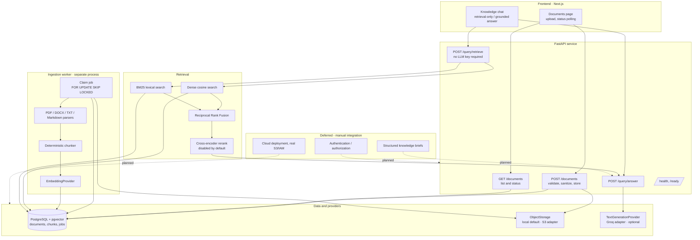
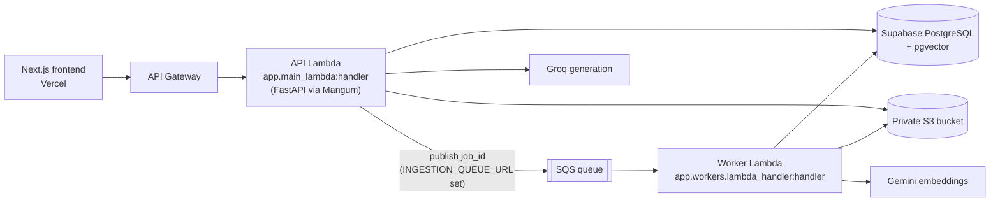

# Architecture

## Current state (S1–S4 complete)

The end-to-end knowledge path is implemented locally: upload → validation → local object storage → parse → chunk → embed → pgvector + BM25 retrieval → RRF fusion → optional reranking → context assembly → grounded answer with citations. PostgreSQL is the authoritative store for documents, chunks, and ingestion jobs. Structured request/job telemetry, ingestion retry and stale-lock recovery, upload content sniffing, and a deterministic offline retrieval evaluation are also implemented (S3) and covered below. A production AWS topology (Lambda, SQS, S3, Gemini embeddings) exists in code but is not deployed (S4/ND-02) — see [AWS production topology](#aws-production-topology-code-ready-not-deployed). Authentication is not implemented and no cloud infrastructure is provisioned — see the root [README's manual integration section](../README.md#manual-integration--deployment).

## Ingestion

`DocumentService.upload` sanitizes the filename, validates extension against MIME type and the configured allowlist, enforces the size limit, writes the object under `{workspace}/{document}/{filename}`, and inserts the `Document` and queued `IngestionJob` in one transaction. If the database write fails, the stored object is deleted so storage does not leak orphans. If `INGESTION_QUEUE_URL` is configured, it then publishes the job ID to SQS (see [AWS production topology](#aws-production-topology-code-ready-not-deployed)); that publish is best-effort and logged loudly on failure, never silent, since the DB row is already the durable source of truth.

`IngestionWorker.process_next` claims one queued job with `FOR UPDATE SKIP LOCKED`, loads the object, parses, chunks, embeds, replaces any existing chunks for that document, and finalizes. Chunk rows and the terminal job/document status commit together, so a partially indexed document cannot appear `completed`. Failures roll back, record `ExceptionType: message` on the job, and set the document to `failed` (or back to `queued` for a retry - see [Reliability](#reliability)). The worker is a plain Python process (`app.workers.run_ingestion`); no Redis, Celery, or Kafka is introduced. `IngestionWorker.process_job(job_id)` is the same pipeline entered a different way - claiming one *specific* job instead of polling for the next one - used by the SQS-triggered worker Lambda.

At four points during processing the worker records a lightweight `stage` on the job (`parsing`, `chunking`, `embedding`, `indexing`) via `DatabaseIngestionJobQueue.update_stage`, each its own small commit guarded to `status = 'processing'`. This is UI feedback only - `status` remains the sole source of truth for whether a document is actually done - and the frontend shows it on the document's status pill while a job is in progress.

## Retrieval trade-offs

**Dense:** a single SQL statement joins `document_chunks` to `documents`, filters on `workspace_id` and `status = completed`, orders by pgvector cosine distance, and returns similarity as the score. Workspace filtering happens in SQL, so cross-workspace rows are never fetched.

**Lexical (BM25):** PostgreSQL remains the authoritative source of chunk text. For this MVP the BM25 index is built in application memory per workspace and cached in a process-level dictionary. The cache key is a version tuple of `(max(documents.updated_at), count(documents))` for completed documents in that workspace; when the version changes after ingestion, the index is rebuilt on the next query. **Trade-off:** this is simple and adds no external service, but the index is per-process (not shared across API workers), is rebuilt after restarts, and will not scale to very large corpora. A future phase should move lexical search to PostgreSQL full-text search or a dedicated index.

**Fusion:** `reciprocal_rank_fusion` scores each candidate as `1/(k + rank)` summed across the dense and lexical lists, with a configurable `k`. Candidates retrieved by both paths outrank those found by only one. Component scores are preserved on the result so the retrieval endpoint and UI can show dense, BM25, and fused values. Ties break deterministically on chunk ID.

**Reranking:** disabled by default. When `RERANKER_ENABLED` is set, a cross-encoder reorders fused candidates; any exception or unavailable model falls back to RRF order, so reranking can never break a query. No model is downloaded in the default test suite.

## Grounded QA and citations

`KnowledgeQueryService` builds a numbered context block (`[S1]`, `[S2]`, …) from retrieved chunks and instructs the model to use only the supplied excerpts. Citation objects are constructed by application code from `RetrievalCandidate` metadata — document ID, filename, chunk ID, page/location, excerpt, and relevance scores — so the model cannot invent identifiers. Any `[Sn]` label the model emits beyond the supplied source count is stripped from the answer. When no candidates are retrieved, the service returns an explicit "no relevant information" response with zero citations rather than inventing content. If the generation provider has no API key, the service raises a configuration error that the API surfaces as `503`, and the UI directs the user to retrieval-only mode.

## Domain model

`Workspace` owns `User` and `Document`. `Document` carries filename, storage key, MIME type, size, ingestion status, and timestamps. `DocumentChunk` carries text, ordinal index, optional page number, JSON location metadata, and a 384-dimension vector. `IngestionJob` carries a constrained status (`queued`/`processing`/`completed`/`failed`), attempt count, lock timestamp, and error message.

The embedding column is fixed at 384 dimensions in `0001_initial_schema`. Settings reject any other value so application metadata cannot drift from the database; changing it requires a migration and re-embedding all chunks.

## Security and operations

No authentication exists. The development workspace endpoint returns a fixed, idempotently created workspace for local use only — it is **not** an authorization boundary, and the API must not be exposed publicly. Upload validation now includes content sniffing: PDF and DOCX uploads must start with their real magic bytes (`%PDF-`, `PK\x03\x04`) in addition to matching extension and MIME type, so a renamed or mislabeled file is rejected rather than silently ingested. Malware scanning, rate limiting, TLS, secret management, IAM scoping, workspace-level authorization, and audit logging remain future work. Provider credentials come only from environment variables and are never placed in source, images, logs, or frontend configuration.

Retrieved document text is treated as **untrusted data, never as instructions**. `KnowledgeQueryService` wraps the context block with an explicit warning, and the system prompt tells the model to ignore any command, role-change, or system-like text found inside an excerpt. This does not make prompt injection impossible (no purely prompt-based defense does), but it bounds the blast radius: citations are always constructed by application code from the actual `RetrievalCandidate` list, never parsed out of the model's output, so an injected instruction cannot fabricate a source or attribute an excerpt to the wrong document — it can, at most, influence prose inside the answer text. `tests/test_knowledge_query.py` exercises this with a document chunk containing an embedded fake instruction and an out-of-range `[S99]` label, asserting the citation list stays bounded to what was actually retrieved. Workspace isolation is enforced redundantly: in SQL for dense retrieval (`WHERE documents.workspace_id = :workspace_id`), in the BM25 cache key and per-workspace index for lexical retrieval, and end-to-end in `test_retrieval.py`, which asserts a query against one workspace's BM25 index returns nothing from another.

## Observability

Logging is structured JSON (`structlog`), configured once in `app.core.logging`. A FastAPI middleware (`app.main.request_telemetry_middleware`) assigns each HTTP request a request ID (reusing an inbound `X-Request-ID` header when present), binds it via `structlog.contextvars` so every log line emitted while handling that request carries it automatically, echoes it back in the response header, and logs the method/path/status/duration on completion. The ingestion worker does the equivalent per job, binding `job_id`/`document_id` for the duration of `process_next`.

Recorded fields, only when meaningful and never fabricated:
- **Latency:** `duration_ms` on HTTP requests, ingestion jobs, retrieval, answer generation, and (inside the Groq provider) the raw LLM call.
- **Retrieval counts:** dense/lexical/fused candidate counts and whether a reranker actually ran, logged once per `retrieve()` call.
- **Provider/model metadata:** the Groq provider logs `provider="groq"` and the configured model name with every generation.
- **Token usage:** logged from the Groq response's `usage` field when the API returns one; fields are `None` rather than guessed when it does not.

No monitoring stack, metrics exporter, or tracing backend was introduced — this is log-based observability only, consistent with the MVP scope.

## Reliability

Two gaps in the S2 job queue are closed without changing its shape (still a single `ingestion_jobs` table, still `FOR UPDATE SKIP LOCKED`, still no external queue service):

- **Retry on transient failure.** `IngestionWorker` compares the job's `attempts` (already incremented by `claim_next`) against `MAX_INGESTION_ATTEMPTS` (default 3). Below the limit, `DatabaseIngestionJobQueue.mark_failed(..., requeue=True)` sets the job back to `queued` instead of `failed`, so the next worker poll retries it; the failure reason is still recorded on the job. At or past the limit, it fails permanently as before.
- **Stale-lock recovery.** If a worker is killed mid-job, its claimed row stays `processing` forever under the original design. `IngestionWorker.process_next` now calls `DatabaseIngestionJobQueue.recover_stale(INGESTION_STALE_AFTER_SECONDS)` (default 600s) before each claim attempt, which requeues any job still `processing` with a `locked_at` older than the threshold.

Both are plain SQL `UPDATE ... WHERE` statements guarded by status, so they compose safely with `SKIP LOCKED` claiming and the existing conditional-completion invariant — a partially indexed document still cannot show `completed`.

A third case matters only for the push-based (SQS) path: at-least-once delivery means a job's ID can arrive twice. `DatabaseIngestionJobQueue.claim_job(job_id)` only claims a job whose status is still `queued`; a redelivered message for a job that's already `processing`, `completed`, or `failed` finds nothing to claim and `IngestionWorker.process_job` returns `False` - a logged, intentional no-op, not a silently dropped failure and not a duplicate run.

## Evaluation

`app/evaluation/` provides a small, deterministic, fully offline retrieval evaluation — no database, network access, or credentials, runnable anywhere the test suite runs (`python -m app.evaluation.run` from `backend/`). It exercises the real `HybridRrfRetriever` (dense + BM25 + RRF) against a synthetic five-document policy fixture and five queries with known-relevant answers, reporting **Recall@K** (fraction of relevant chunks found in the top K) and **MRR** (mean reciprocal rank of the first relevant hit). Because a real embedding model is an optional dependency and must stay offline-safe, dense retrieval is stood in for by a dependency-free bag-of-words cosine-similarity scorer (`BagOfWordsDenseRetriever`) — it is not the production embedding provider, only a deterministic proxy for exercising fusion. `tests/test_evaluation.py` pins the fixture's expected Recall@3 (1.0) and MRR (≥0.8) as a regression guard: a drop signals a real change in fusion or ranking behavior, not fixture noise. This evaluation validates retrieval mechanics, not production embedding quality — a live run against `sentence-transformers` and real documents remains future work.

## AWS production topology (code-ready, not deployed)

The target production shape this codebase is written for - not provisioned, not deployed, no real AWS/Supabase/Gemini credentials used anywhere in this repository:

Same application code runs both locally and here - only the outer adapters differ:

- **API Lambda** (`app/main_lambda.py`): `Mangum(app)` wraps the identical FastAPI app used by `uvicorn`/`docker compose` locally. No route or service code is Lambda-specific.
- **Worker Lambda** (`app/workers/lambda_handler.py`): an SQS event handler that extracts a job ID from each message body and calls `IngestionWorker.process_job(job_id)` - the same `IngestionWorker` class the local polling worker uses, just entered by a specific ID instead of "claim whatever's next."
- **Storage and queue credentials**: `S3StorageProvider` and `SqsJobPublisher` (`app/providers/queue/sqs.py`) construct their `boto3` clients with no explicit key/secret when none are configured, so they resolve through the AWS SDK's default credential chain - in Lambda, that's the function's IAM execution role. `AWS_ACCESS_KEY_ID`/`AWS_SECRET_ACCESS_KEY` remain available only for non-Lambda testing.
- **Embeddings**: `GeminiEmbeddingProvider` (`app/providers/embeddings/gemini.py`), selected by `EMBEDDING_PROVIDER=gemini`, calls `output_dimensionality=384` to match the pinned vector column, avoiding a sentence-transformers/torch dependency in the Lambda package. It has not been exercised against a live Gemini API in this repository - see `DECISIONS.md`.
- **Database pooling**: `app/db/session.py` switches to SQLAlchemy's `NullPool` when it detects a Lambda runtime (`AWS_LAMBDA_FUNCTION_NAME` is set), since a long-lived connection pool doesn't fit a frozen/thawed execution model or how Supabase expects serverless clients to connect. Local/long-running processes keep the default pool.
- **Packaging**: `backend/lambda/requirements.txt` and `backend/lambda/README.md` describe a minimal, manual packaging process. No SAM/CDK/Terraform/Serverless-Framework template, API Gateway route config, or IAM policy document is included - wiring those up is the deliberately deferred manual step described in the root README.

Reliability property carried over unchanged: SQS's at-least-once delivery means a job ID can be delivered twice, and `claim_job` (see [Reliability](#reliability)) makes a redelivery a safe no-op rather than a duplicate ingestion run.
